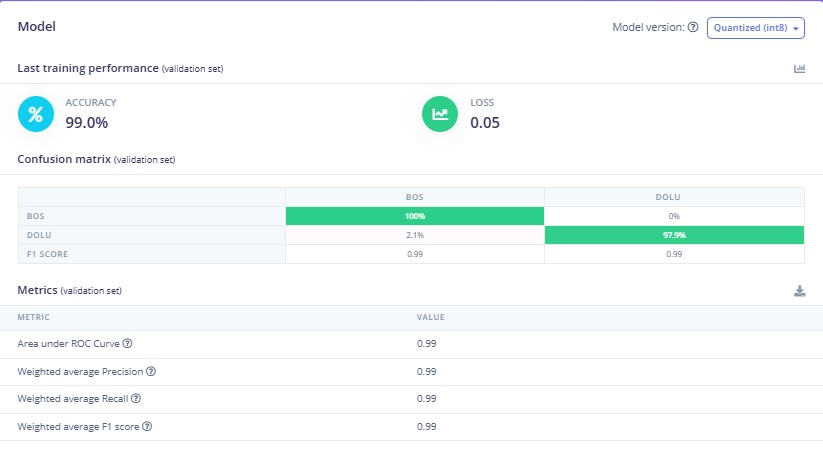
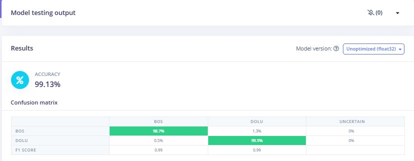
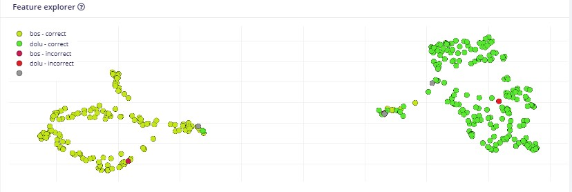
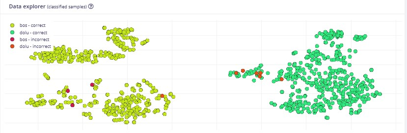

# 🥚 Egg Viability Detection System

## 📑 Table of Contents

- [Project Overview](#-project-overview)
- [Core Features](#-core-features)
- [Mobile Application](#-mobile-application)
- [AI Model Performance](#-ai-model-performance)
- [System Architecture](#-system-architecture)
- [Technologies Used](#️-technologies-used)
- [Source Code Availability](#-source-code-availability)
- [Future Improvements](#-future-improvements)

An AI-powered egg viability detection system developed using **Flutter**, **ESP32-CAM**, **TensorFlow Lite**, and **Edge Impulse**.

This project captures egg images through an ESP32-CAM module and performs local AI inference using a TensorFlow Lite model inside the Flutter mobile application.

The application also provides camera management, LED brightness control, 360° stepper motor control, image gallery management, and automated image capture for egg inspection.

> **Note:** This repository showcases the project architecture, mobile application, and AI performance. The complete source code, trained models, and datasets are maintained in a private repository.

---

# ✨ Core Features

## 🤖 Artificial Intelligence

- Egg viability classification using TensorFlow Lite
- Edge Impulse transfer learning model
- 99%+ validation accuracy
- Local AI inference on the mobile device
- Confusion Matrix
- Precision, Recall and F1 Score evaluation

## 📱 Mobile Application

- Live ESP32-CAM stream
- Prediction interface
- Smart gallery
- ESP32 IP configuration

## ⚙️ Embedded Hardware

- ESP32-CAM
- Adjustable LED brightness
- 360° stepper motor control
- Single image capture
- Multi-angle image capture

## 📂 Dataset Management

- Automatic filename indexing
- Servo angle added to image filename
- Categorized gallery
- Automatic image organization

---

# 📱 Mobile Application

The Flutter mobile application is responsible for controlling the hardware, managing image acquisition, and performing on-device AI inference using a TensorFlow Lite (Float32) model.

<table>
<tr>
<td align="center">
<b>🏠 Main Menu</b>  

</td>

<td align="center">
<b>🎛️ Control Center</b>  

</td>

<td align="center">
<b>🌐 ESP32 Settings</b>  

</td>
</tr>

<tr>
<td align="center">
<b>💡 LED & 360° Stepper Motor</b>  

</td>

<td align="center">
<b>🖼️ Smart Gallery</b>  

</td>

<td align="center">
<b>📝 Automatic File Naming</b>  

</td>
</tr>
</table>

### ✨ Key Capabilities

- 📷 Live camera stream from ESP32-CAM
- 🧠 Local AI inference using TensorFlow Lite (Float32)
- 💡 Adjustable LED brightness
- ⚙️ 360° stepper motor control
- 📸 Single and multi-angle image capture
- 🗂️ Smart gallery with categorized images
- 📝 Automatic file naming with angle metadata and incremental indexing

# 🧠 AI Model Performance

The egg viability classification model was trained using **Edge Impulse** with **Transfer Learning** and deployed as a **TensorFlow Lite (Float32)** model for on-device inference in the Flutter application.

The model performs inference entirely on the mobile device without requiring an internet connection, enabling fast and efficient real-time predictions.

<table>
<tr>
<td align="center" width="50%">

<b>📊 Transfer Learning Results</b>  

</td>

<td align="center" width="50%">

<b>✅ Model Testing Results</b>  

</td>
</tr>

<tr>
<td align="center">

<b>📈 Feature Explorer</b>  

</td>

<td align="center">

<b>📉 Data Explorer</b>  

</td>
</tr>
</table>

---

## 📋 Performance Summary

| Metric | Value |
|---------|------:|
| Validation Accuracy | **99%+** |
| Weighted Precision | **0.99** |
| Weighted Recall | **0.99** |
| Weighted F1 Score | **0.99** |
| ROC AUC | **0.99** |
| Deployment | **TensorFlow Lite (Float32)** |
| Training Platform | **Edge Impulse** |

---

### 🚀 Highlights

- 🧠 Transfer Learning based image classification
- 📱 On-device AI inference with TensorFlow Lite (Float32)
- ⚡ Real-time prediction on the Flutter application
- 📊 High classification accuracy with strong generalization performance
- 📈 Visual feature separation using Feature Explorer
- 📂 Organized dataset validation using Data Explorer

## 🏗️ System Architecture

---

# 🛠️ Technologies Used

| Category | Technology |
|----------|------------|
| Mobile Framework | Flutter |
| Programming Language | Dart |
| AI Framework | TensorFlow Lite (Float32) |
| AI Development Platform | Edge Impulse |
| Embedded Hardware | ESP32-CAM |
| Motor Control | 360° Stepper Motor |
| Lighting System | Adjustable LED |
| Communication | Wi-Fi |
| Machine Learning | Transfer Learning |
| Computer Vision | Image Classification |

---

# 🔒 Source Code Availability

This repository showcases the project's architecture, methodology, mobile application, and AI model performance.

The complete source code, TensorFlow Lite model, Edge Impulse project, datasets, and embedded firmware are kept in a private repository to protect the project's intellectual property.

If you are interested in collaboration, research, commercial licensing, or a live demonstration, please feel free to contact me.

