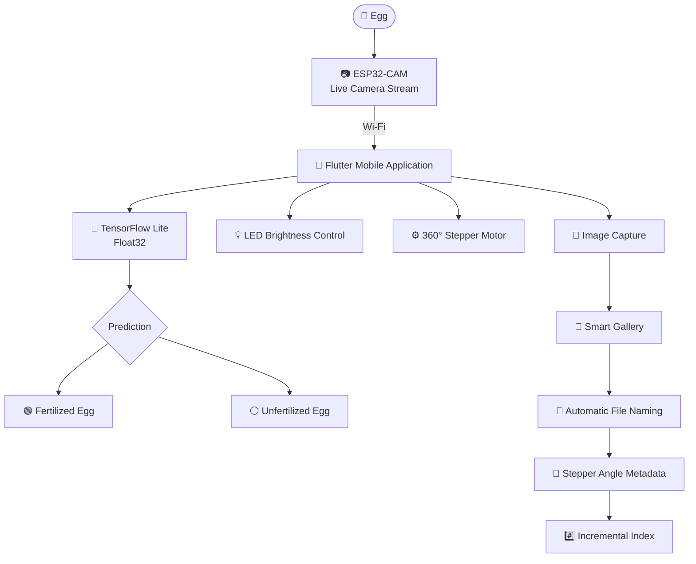

# 🥚 Egg Viability Detection System

An AI-powered egg viability detection system developed using **Flutter**, **ESP32-CAM**, **TensorFlow Lite**, and **Edge Impulse**.

This project captures egg images through an ESP32-CAM module and performs local AI inference using a TensorFlow Lite model inside the Flutter mobile application.

The application also provides camera management, LED brightness control, 360° stepper motor control, image gallery management, and automated image capture for egg inspection.

> **Note:** This repository showcases the project architecture, mobile application, and AI performance. The complete source code, trained models, and datasets are maintained in a private repository.

---

# ✨ Core Features

## 🤖 Artificial Intelligence

- Egg viability classification using TensorFlow Lite
- Edge Impulse transfer learning model
- 99%+ validation accuracy
- Local AI inference on the mobile device
- Confusion Matrix
- Precision, Recall and F1 Score evaluation

## 📱 Mobile Application

- Live ESP32-CAM stream
- Prediction interface
- Smart gallery
- ESP32 IP configuration

## ⚙️ Embedded Hardware

- ESP32-CAM
- Adjustable LED brightness
- 360° stepper motor control
- Single image capture
- Multi-angle image capture

## 📂 Dataset Management

- Automatic filename indexing
- Servo angle added to image filename
- Categorized gallery
- Automatic image organization

---

# 📱 Mobile Application

The Flutter mobile application is responsible for controlling the hardware, managing image acquisition, and performing on-device AI inference using a TensorFlow Lite (Float32) model.

## 🏠 Main Menu

The main dashboard provides quick access to all application modules.

---

## 🎛️ Control Center

The Control Center is the core of the application. It connects to the ESP32-CAM, loads the TensorFlow Lite model, displays the live camera stream, and manages the image acquisition process.

---

## 🌐 ESP32 Connection Settings

Users can configure the ESP32-CAM IP address directly from the application, allowing quick connection to different devices.

---

## 💡 LED & 360° Stepper Motor Control

The application allows users to adjust LED brightness and control the 360° stepper motor for automated multi-angle image acquisition.

---

## 🖼️ Smart Gallery

Captured images are automatically categorized and stored inside the application for easy access and review.

---

## 📝 Automatic File Naming

To simplify dataset management, every captured image is automatically assigned a unique filename.

The filename contains:

- Image name
- Stepper motor angle
- Incremental index

This prevents duplicate filenames while preserving the capture position of every image.

---

# 🧠 AI Model Performance

The egg viability classification model was trained using **Edge Impulse** with **Transfer Learning** and deployed as a **TensorFlow Lite (Float32)** model for on-device inference in the Flutter application.

The model achieves high classification performance while running entirely on the mobile device without requiring an internet connection.

---

## 📊 Transfer Learning Results

The following metrics summarize the performance of the trained model.

- Accuracy
- Loss
- Precision
- Recall
- F1 Score
- ROC AUC
- Confusion Matrix

---

## ✅ Model Testing Results

The trained TensorFlow Lite model was evaluated using unseen test images to verify its real-world performance.

---

## 📈 Feature Explorer

The Feature Explorer visualization demonstrates how the extracted image features are grouped by the trained model. A clear separation between classes indicates strong feature learning and improved classification capability.

---

## 📉 Data Explorer

The Data Explorer provides an overview of the labeled dataset used during training and helps verify the quality and distribution of collected samples.

## 🏗️ System Architecture

---

# 🛠️ Technologies Used

| Category | Technology |
|----------|------------|
| Mobile Framework | Flutter |
| Programming Language | Dart |
| AI Framework | TensorFlow Lite (Float32) |
| AI Development Platform | Edge Impulse |
| Embedded Hardware | ESP32-CAM |
| Motor Control | 360° Stepper Motor |
| Lighting System | Adjustable LED |
| Communication | Wi-Fi |
| Machine Learning | Transfer Learning |
| Computer Vision | Image Classification |
